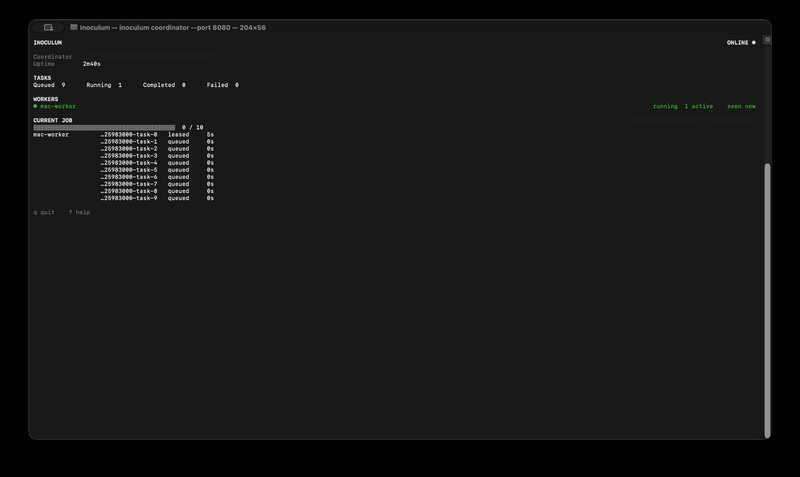

# Inoculum

Turn the computers you already own into a tiny compute pool.

Inoculum is a small execution pool for independent, finite jobs on a trusted
LAN. Run one coordinator, connect outbound workers from your other machines,
submit a batch, and let leases and retries handle worker failure. It is designed
for 2–10 user-owned computers, not permanent or public infrastructure.



## Why Inoculum?

Some workloads are already a set of unrelated pieces: probe many endpoints or
run duplicate-safe diagnostics. They do not need a DAG, containers, a message
broker, or a permanent cluster.

Inoculum provides a deliberately small middle ground:

- one coordinator address and listening port;
- one FIFO queue with lease-based task ownership;
- workers that pull only when they have local capacity;
- automatic reassignment when a worker disappears;
- a terminal UI with a stable plain-output fallback;
- versioned manifests and ordered machine-readable results.

## Quick demo

With the platform binary available as `./inoculum`, start the coordinator:

```bash
export INOCULUM_TOKEN='a-long-random-secret'
./inoculum coordinator --port 8080
```

Copy the fingerprint it prints and connect a worker:

```bash
export INOCULUM_TOKEN='a-long-random-secret'
./inoculum worker \
  --coordinator '<coordinator-lan-ip>:8080' \
  --id mac-worker \
  --coordinator-fingerprint '<fingerprint>'
```

Submit four duplicate-safe diagnostic tasks:

```bash
export INOCULUM_TOKEN='a-long-random-secret'
./inoculum submit \
  --coordinator '<coordinator-lan-ip>:8080' \
  --type diagnostic_sleep \
  --input 2s \
  --tasks 4
```

Run the worker command on another machine with a different `--id` to add it to
the pool. See [Quick start on a LAN](#quick-start-on-a-lan) for first-trust and
subsequent-start details.

## How it works

```text
                submit
                  |
                  v
            +-------------+
            | coordinator |
            +-------------+
              ^         ^
              |         |
       outbound pull  outbound pull
              |         |
        +----------+ +----------+
        | worker A | | worker B |
        +----------+ +----------+
```

Only the coordinator listens for Inoculum connections. It owns the FIFO queue
and leases. Workers connect outbound, claim tasks, renew leases while executing,
and return results; they never listen for incoming tasks.

If a worker disappears, its lease expires and the same stable task becomes
available to another worker. Delivery is **at least once**: duplicate execution
is possible if a worker finishes but cannot deliver its result. Workloads must
tolerate that possibility.

The deeper runtime and protocol reference is in [SPEC.md](SPEC.md).

## Releases and installation

Inoculum is one binary with three subcommands:

```text
inoculum coordinator
inoculum worker
inoculum submit
```

Release `v1.0.0` provides:

- `inoculum_v1.0.0_darwin_arm64.tar.gz`
- `inoculum_v1.0.0_linux_amd64.tar.gz`
- `inoculum_v1.0.0_windows_amd64.zip`
- `SHA256SUMS`

Each archive contains `inoculum` (or `inoculum.exe`), `LICENSE`, and
`THIRD_PARTY_LICENSES`. Download the matching archive and checksum file from the
[GitHub release](https://github.com/thevalmarch/inoculum/releases/tag/v1.0.0)
when it is published.

macOS arm64:

```bash
grep 'darwin_arm64' SHA256SUMS | shasum -a 256 -c -
tar -xzf inoculum_v1.0.0_darwin_arm64.tar.gz
./inoculum --version
```

Linux amd64:

```bash
grep 'linux_amd64' SHA256SUMS | sha256sum -c -
tar -xzf inoculum_v1.0.0_linux_amd64.tar.gz
chmod +x inoculum
./inoculum --version
```

You may move the extracted binary to a directory on your `PATH`. Release
binaries are not signed or notarized; macOS may require explicit approval in
local Privacy & Security settings.

Windows amd64 is **experimental**: it is compile-tested and its path-policy
behavior is unit-tested, but its runtime has not been physically validated.
Extract the zip and run `inoculum.exe --version` from PowerShell.

No Homebrew, apt, winget, Scoop, or installer package is currently published.

## Quick start on a LAN

Choose the coordinator machine's LAN address and replace
`<coordinator-lan-ip>` in the examples. Keep one long shared token private and
provide the same value to the coordinator, workers, and submit clients.

Start the coordinator as shown in the quick demo. It prints the certificate
fingerprint required for a machine's first connection.

On each worker machine, verify that fingerprint explicitly:

```bash
export INOCULUM_TOKEN='a-long-random-secret'
./inoculum worker \
  --coordinator '<coordinator-lan-ip>:8080' \
  --id linux-worker \
  --coordinator-fingerprint '<fingerprint>'
```

After successful verification, the coordinator identity is saved for that OS
user. Later worker starts omit the fingerprint:

```bash
./inoculum worker \
  --coordinator '<coordinator-lan-ip>:8080' \
  --id linux-worker
```

Worker and submit share the saved trust record when run by the same OS user.
Each different machine or OS user performs its own first verification. If the
submit machine has not yet established trust, add
`--coordinator-fingerprint '<fingerprint>'` to its first submit command.

`--timeout` controls only how long submit waits locally. Reaching that timeout
does not mark the coordinator job failed; the in-memory job can continue.

## Real workload: HTTP probe manifests

`http_probe` is the first bounded real workload. A versioned JSON manifest turns
distinct URLs into independent tasks with stable user-defined keys.

Create `probes.json`:

```json
{
  "version": 1,
  "type": "http_probe",
  "tasks": [
    {"key": "homepage", "input": "https://example.com/"},
    {"key": "docs", "input": "https://example.com/docs"}
  ]
}
```

Submit it and save the detailed result:

```bash
export INOCULUM_TOKEN='a-long-random-secret'
./inoculum submit \
  --coordinator '<coordinator-lan-ip>:8080' \
  --manifest probes.json \
  --output probe-results.json \
  --timeout 2m
```

Retries preserve each key, and exported tasks remain in manifest order.
Manifest V1 accepts one `http_probe` type and up to 1,000 tasks. Keys are unique
and bounded to 128 bytes; URL inputs are bounded to 4,096 bytes; the manifest
and submission request are bounded to 5 MiB.

Each probe performs a bounded `HEAD` request with normal target TLS verification
and limited redirects. It records the status, final URL, elapsed time, declared
content length, TLS certificate expiry when available, attempts, and final
worker. Private and LAN endpoints are intentionally allowed.

## Result export

`--output` is strongly recommended for manifest submissions. Terminal output
stays progress-oriented while the JSON file contains ordered per-task detail:

```json
{
  "job_id": "pull-job-1787005804821661000",
  "state": "completed",
  "tasks": [
    {
      "key": "homepage",
      "state": "completed",
      "attempts": 1,
      "worker": "mac-worker",
      "output": {
        "status_code": 200,
        "final_url": "https://example.com/",
        "elapsed_ms": 42,
        "declared_content_length": 1256,
        "tls_certificate_expiry": "2026-11-10T23:59:59Z"
      }
    }
  ]
}
```

Known final failures are exported before submit exits nonzero. Result files do
not contain Inoculum tokens or Authorization headers.

## Simple submit mode

Simple mode repeats the same input a requested number of times. It is intended
for diagnostics and lease/failover tests:

```bash
./inoculum submit \
  --coordinator '<coordinator-lan-ip>:8080' \
  --type diagnostic_sleep \
  --input 2s \
  --tasks 4
```

Use manifest mode for batches with distinct inputs. Manifest mode cannot be
combined with `--type`, `--input`, or `--tasks`.

## Terminal and plain modes

Supported interactive terminals receive a restrained live TUI for coordinator,
worker, and submit. It summarizes connectivity, active work, progress, and
failures without emitting one line per task.

Redirected output, CI, `TERM=dumb`, and `--plain` use stable line-oriented
output without terminal control sequences. Additional presentation controls are
`--verbose`, `--no-color`, `--ascii`, and `--log-file <path>`.

## Security model

Inoculum is intended for a trusted, user-controlled LAN. Direct public-internet
exposure is unsupported.

- The coordinator serves HTTPS using one stable self-signed identity.
- First trust requires an explicit fingerprint; there is no silent trust on
  first use.
- Successful verification saves that identity for later worker and submit runs.
- Every API request uses a shared bearer token supplied through
  `INOCULUM_TOKEN` or `--token`; the environment variable is recommended.
- A mismatched coordinator identity is rejected before the token is sent.
- There are no worker certificates, plaintext mode, nonce cache, or clock-based
  authentication checks.
- Optional sanitized audit logging is available with `--audit-log <path>`.

Possession of the token authorizes workers to probe HTTP and HTTPS destinations
reachable from those workers, including private endpoints. Give it only to
machines you control. See [SPEC.md](SPEC.md#security-model) for the precise trust
and protocol boundary.

## Lease and retry behavior

The coordinator owns one global policy:

| Coordinator flag | Default | Meaning |
|---|---:|---|
| `--lease-duration` | `6s` | Time a worker owns a task unless it renews |
| `--max-attempts` | `3` | Claims/execution attempts before permanent failure |

Workers renew active leases. If a worker disappears, its lease expires and the
same task returns to the FIFO queue with its stable identity and manifest key.
This is at-least-once rather than exactly-once execution.

## Built-in task types

| Type | Intended use | Input |
|---|---|---|
| `http_probe` | Bounded HTTP/TLS endpoint inspection; primary manifest workload | One absolute HTTP or HTTPS URL |
| `diagnostic_sleep` | Duplicate-safe lease and failover testing | A positive duration up to 5 minutes |

Inoculum does not execute arbitrary shell commands or external programs.

## Platform support

| Platform | Status |
|---|---|
| macOS arm64 | Physically validated as coordinator, worker, and submit client |
| Linux amd64 | Physically validated as an outbound worker against a macOS coordinator |
| Windows amd64 | Compile-tested and path-policy tested; runtime unvalidated and experimental |

The physical Mac/Linux validation covered HTTPS trust, task distribution,
results, worker disappearance, lease expiry, and reassignment.

## Limitations and non-goals

V1 deliberately does not provide:

- arbitrary shell or command execution;
- DAGs, workflows, or task dependencies;
- persistent services or containers;
- worker-to-worker communication;
- file upload, file transfer, or a distributed filesystem;
- dynamic plugins;
- resource-aware scheduling, capability negotiation, or autoscaling;
- coordinator state persistence;
- public-internet-grade deployment.

Coordinator queue and job state is in memory. Restarting it loses queued,
leased, and completed state. The manifest remains the source for resubmission;
persistence can be reconsidered if long-running workloads justify its cost.

## Build from source

Release-safe builds require Go 1.26.6 or later.

```bash
go build -o build/inoculum ./cmd/inoculum
./build/inoculum --version
```

An ordinary source build reports `inoculum dev`. Release builds inject v1.0.0
with:

```text
-X github.com/thevalmarch/inoculum/internal/version.Value=v1.0.0
```

Cross-build Linux amd64:

```bash
CGO_ENABLED=0 GOOS=linux GOARCH=amd64 \
  go build -o build/inoculum-linux-amd64 ./cmd/inoculum
```

Cross-build Windows amd64 (compile-only):

```bash
CGO_ENABLED=0 GOOS=windows GOARCH=amd64 \
  go build -o build/inoculum-windows-amd64.exe ./cmd/inoculum
```

Inoculum does not distribute binaries between machines.

## Development and verification

Run the complete checks from the repository root:

```bash
go test -count=1 ./...
go test -race -count=1 ./...
go vet ./...
go mod verify
git diff --check
```

Create the v1.0.0 archives and checksums on macOS with:

```bash
./scripts/release.sh v1.0.0
```

The release script stages only the binary, `LICENSE`, and
`THIRD_PARTY_LICENSES` for each platform. Release notes are in
[docs/releases/v1.0.0.md](docs/releases/v1.0.0.md).

## License

Inoculum is available under the Apache License 2.0. Copyright 2026
Volkan 'Val March' Söylemez. See [LICENSE](LICENSE). Third-party notices are in
[THIRD_PARTY_LICENSES](THIRD_PARTY_LICENSES).
